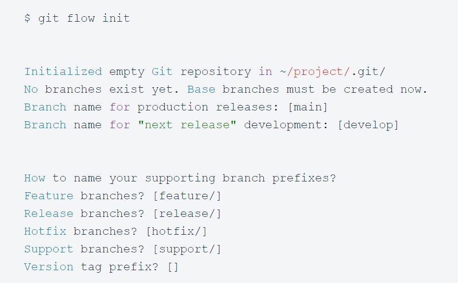
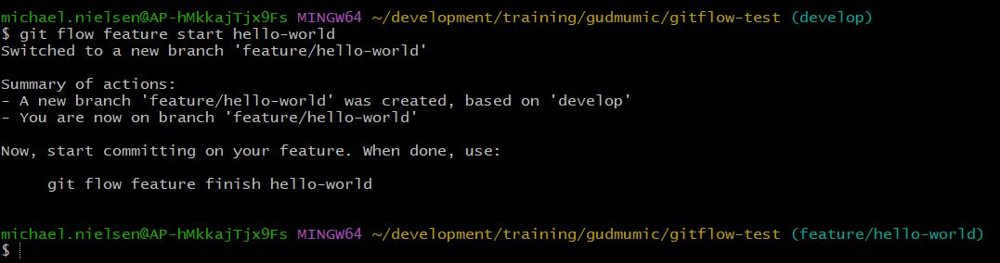
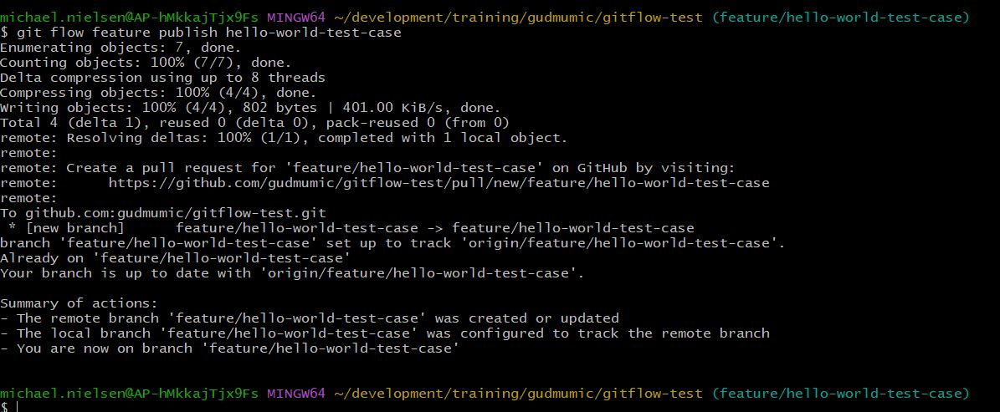
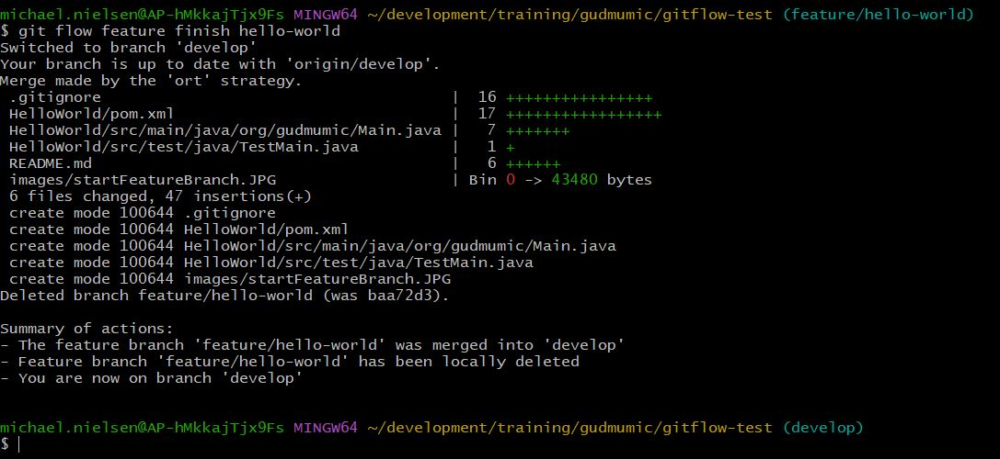
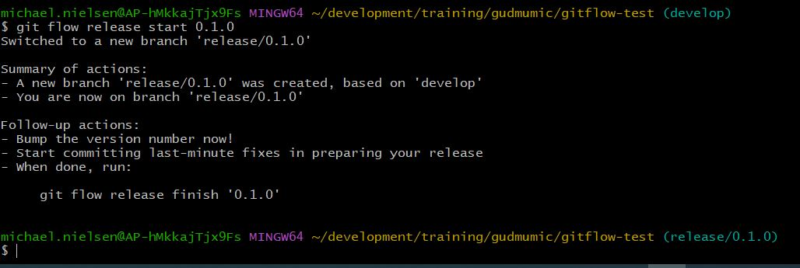

# gitflow-test
Create a repository following the gitflow workflow

## Create develop branch
- `git flow init`

- Push branch to remote repository

## Create a feature branch
- `git flow feature start feature_branch`

## Publish a feature branch and create pull request
- `git flow feature publish feature_branch`

Create the pull request from the link 

## Finish a feature branch
- `git flow feature finish feature_branch`

This command will close and merge feature branch locally into develop branch

- push develop branch to remote respository

## Create a release branch
- `git flow release start release_version

## Finish releae branch
- `git flow release finish release_version

